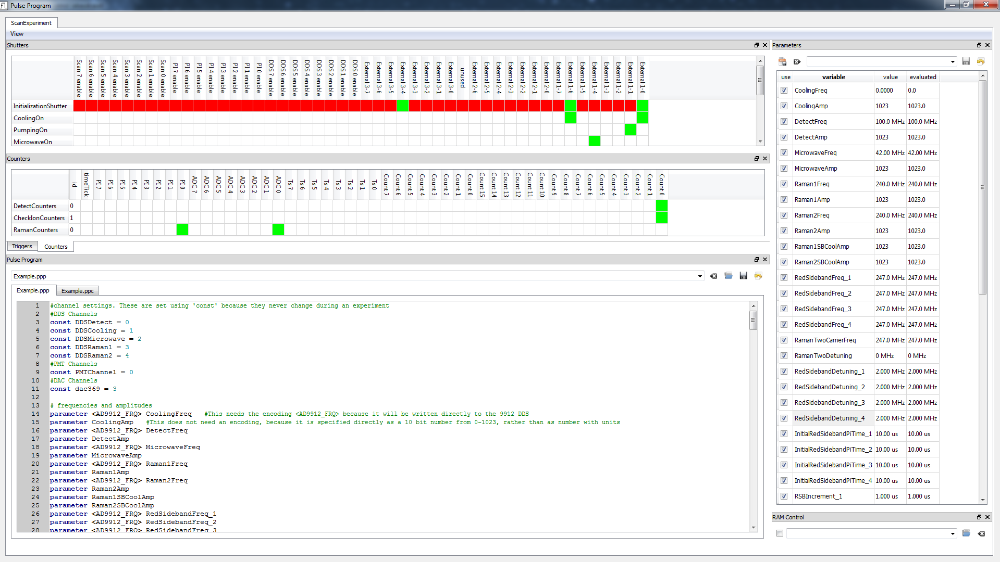

.. include:: inlineImages.include

.. _PulseProgram:

Pulse Program
=============

Once the configuration files have been setup, the main program opens. The first time the program runs, the pulse program window will also open. On subsequent runs, it will return to whatever state it was in when it was closed last. To open the pulse program window, click |pulses| .

   The pulse program interface

The pulse program window consists of the following docks:

   - Pulse Program
      This is the primary dock, which is the text file itself.

   - Parameters
      This is an interface for setting parameters which are declared in the pulse program. Any expression can be typed in here, and the result will be shown under "evaluated." Expressions can reference global variables, and can also reference other pulse program parameters. If parameter *A* depends on parameter *B*, and parameter *B* is scanned, parameter *A* is scanned too. This allows things like this:

   .. figure:: images/parameterDependenciesExample.png
      :scale: 100 %
      :align: center

      Example of pulse program dependencies. If *GateDetuning* is now scanned, *detuning* will be scanned as well (because it depends on *GateDetuning*), as will *RamanGateDDSFreq1* and *RamanGateDDSFreq2* (because they depend on detuning). The code will not allow circular dependencies.

   All parameters can be scanned in the scan control, see :ref:`Scans`.

   If the checkbox next to a parameter is unchecked, the parameter is set to zero. Unchecking the checkbox is equivalent to typing '0' into the value field, without losing the contents of the value field.

   Right clicking

   - Shutters
      Interface for defining shutters. When a `shutter` or `masked_shutter` is declared in the pulse program, a new line will show up here to define that shutter. The columns correspond to individual TTL lines, with names set in the main GUI shutters interface. A shutter sets every TTL bit, while a masked_shutter only sets specified bits.

         - **Green:** TTL High
         - **Red:** TTL Low
         - **White:** No change

      The last 16 bits are internal control lines for turning on and off the PI Loops, and turning on and off the DAC scans.

   - Triggers
      Interface for defining triggers. There are trigger lines for updating the DDSs, updating the DACs, and resetting the PI Loops. When a `trigger` is declared in the pulse program, a line is added.

   - Counters
      Interface for defining counters, or other types of measurements done by the FPGA. The counters interface has the following columns:

         - Count<n>:
            TTL input line <n>

         - TS<n>:
            Timestamp line for TTL input <n>, see :ref:`Timestamps`

         - ADC<n>:
            Voltage on ADC<n>

         - PI<n>:
            line for monitoring output of PI<n>. Note: This is not to be confused with the PI<n> enable lines in the shutters interface! Those lines are for turning PI loops on and off, while these lines are for monitoring the output of PI loops.

         - timeTick:
            TODO: what does this do?

         - id:
            Assigning a counter line an id allows using the same physical counter in multiple roles. For example, suppose you want to monitor fluorescence during cooling and during detection, and you have a single PMT connected to channel 0. You would have two lines for creating the counters, `counter CoolingCounters` and `counter DetectionCounters`. Both would have *channel 0* selected, but one with *id 0* and one with *id 1*. The two counters can then be treated as if they were different physical counters.

   - RAM Control
      Interface for selecting a file to directly write to the RAM on the FPGA board. If the checkbox is checked, the RAM will be written. **Note:** This overwrites the RAM values set by the :ref:`GateSequences` interface.

      The RAM Control file is a YAML file, with a line for each entry in the RAM specifying a value, unit, and encoding. An example can be found in \\IonControl\\config\\RAMFiles\\RamExample.yml. These can then be read out in the program using the `read_ram()` command. This file must be generated by you. One application would be something like sideband cooling with unequal red sideband pi times. The RAM file could specify a list of pi times to use as the sideband cooling progresses.

When a pulse program is saved (CTRL-S in the editor, or click |save|), the program attempts to compile it. If it fails, it indicates where and why it failed. If it is successful, it updates the parameters, shutters, triggers, and counters displays to match the pulse program.

The pulse program written here is run on the FPGA. It is compiled to a machine code that contains microcontroller instructions that are understood by the FPGA. A moderately complex pulse program, with lots of comments, can be seen in /IonControl/config/PulseProgramsPlus/Example.ppp.

Pulse Program Syntax
--------------------

control structures
~~~~~~~~~~~~~~~~~~

The following control structures are supported:

- while loops

   .. code-block:: Python

      experimentsleft = 100
      while experimentsleft>0:
         experimentsleft -= 1

- if then else conditionals

   .. code-block:: Python

      if photonsfound>0:
         experimentsleft -= 1
      else:
         exit( IonLostExitcode )

Variable Types
~~~~~~~~~~~~~~

.. include:: pppDefinitionDocs.rst

Encodings
~~~~~~~~~

.. include:: pppEncodingDocs.rst

Commands
~~~~~~~~

   .. automodule:: Builtins
      :members:
      :exclude-members: exit_
