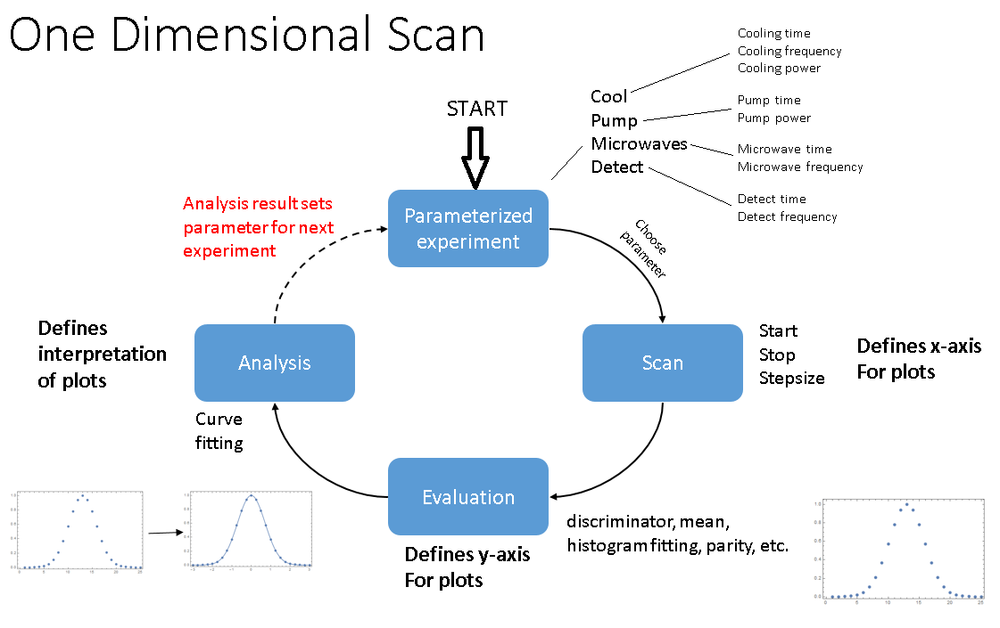

.. include:: inlineImages.include

.. _Scans:

Scans
=====

The scan controls allow performing a one dimensional scan of any parameter, with a specified method of evaluating the returning data, and analyzing the resulting curve. This shows the sequence of a scan:

An analysis is able to push fit results to global variables. Since pulse program parameters can depend on global variables, this can determine the parameter values used for the next scan.

The scan is controlled and examined by the following docks:

Scan Control
------------

Evaluation Control
------------------

Analysis Control
----------------

Traces
------

Fit
---

Progress
--------

Average
-------

Todo List
---------

.. _Timestamps:

Timestamps
----------
